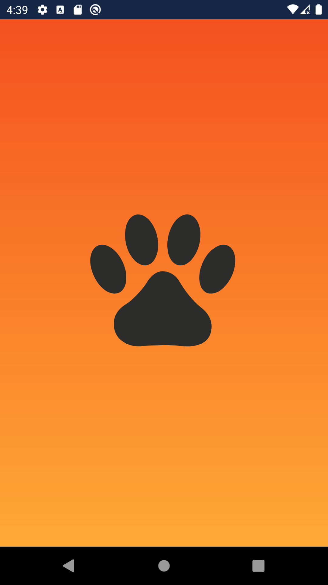
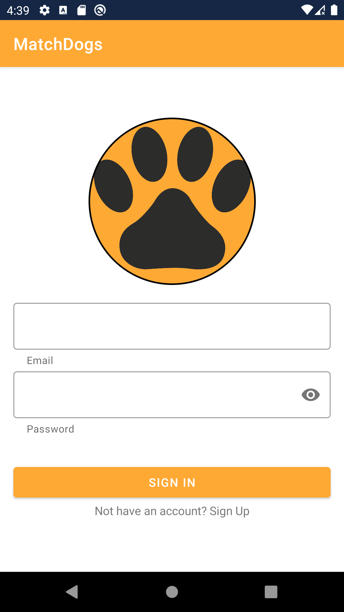
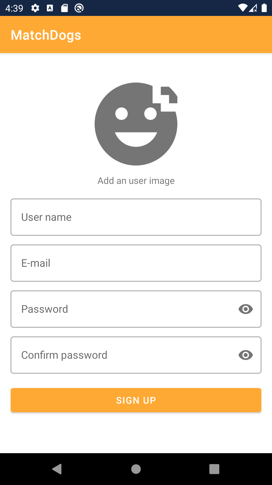
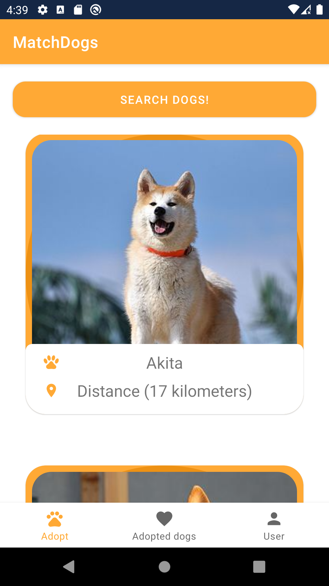
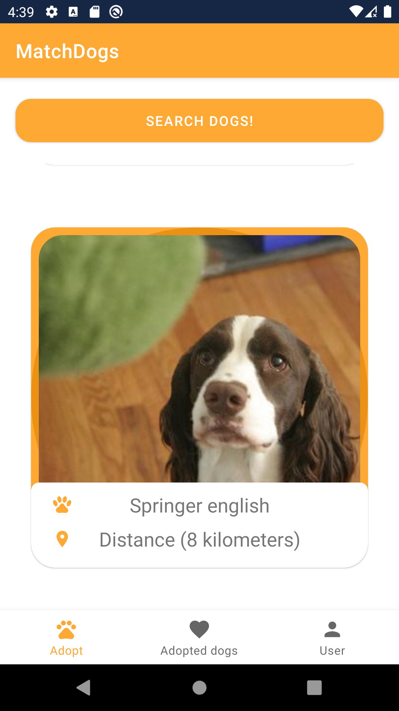
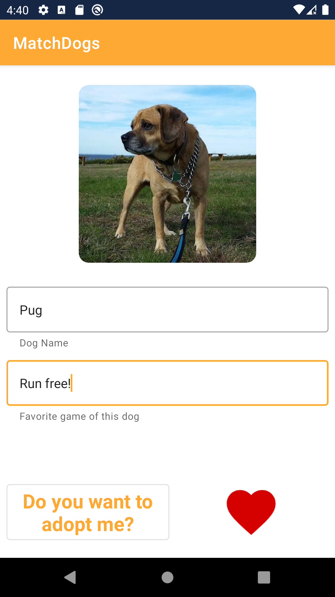
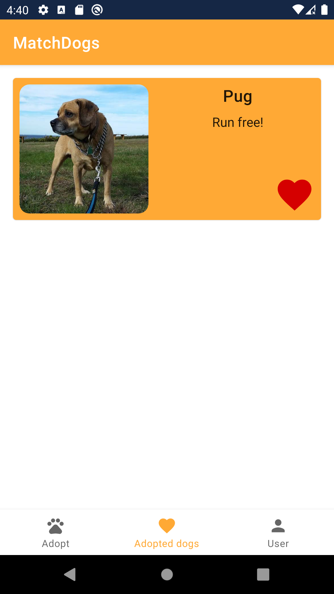
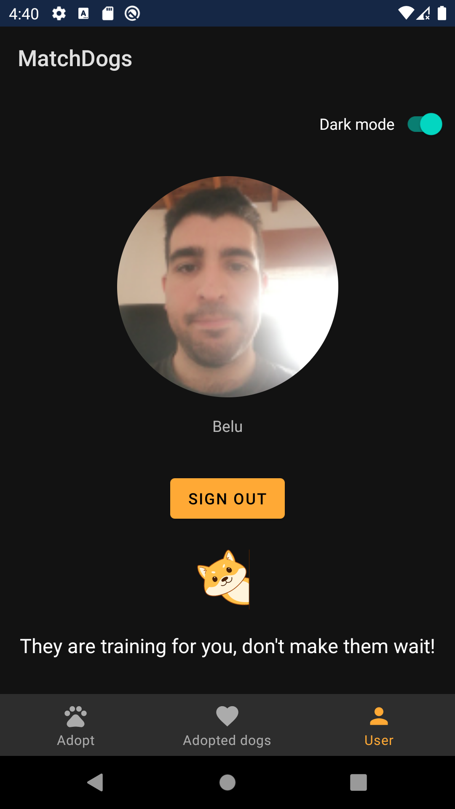

# MatchDogsApp
An app in which you can adopt a dog. Take as much dogs as you can in your phone!

## Features used:
- Firebase
- Retrofit2
- Shared Preferences
- Room
- Bottom Navigation View
- Coroutines
- MVVM
- ViewModel & LiveData
- ViewBinding
- Dependency Injection with Dagger Hilt
- Unit Testing
- Extension functions
- RecyclerView
- Fragments
- Navigation Component
- ConstraintLayout, MaterialCardView
- Splash screen
- And some utils like SwipeToRefresh, CircleImageView, Lottie Animations
##
 

You can see a video here in : 

https://www.linkedin.com/feed/update/urn:li:activity:6847255538162520064/
